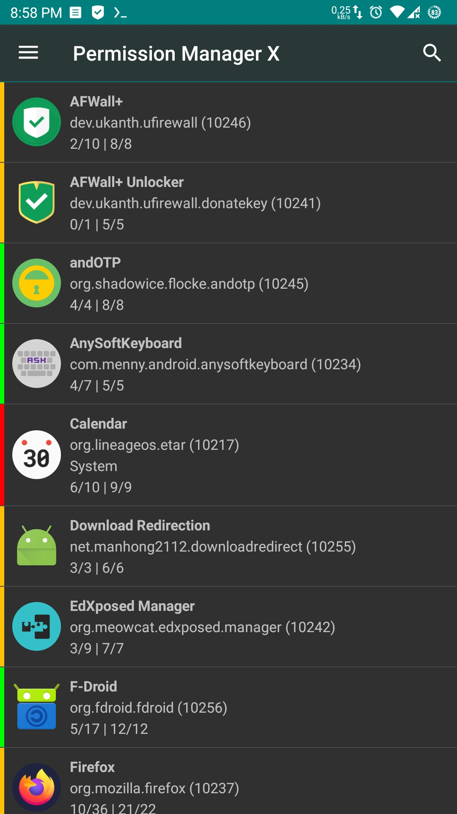
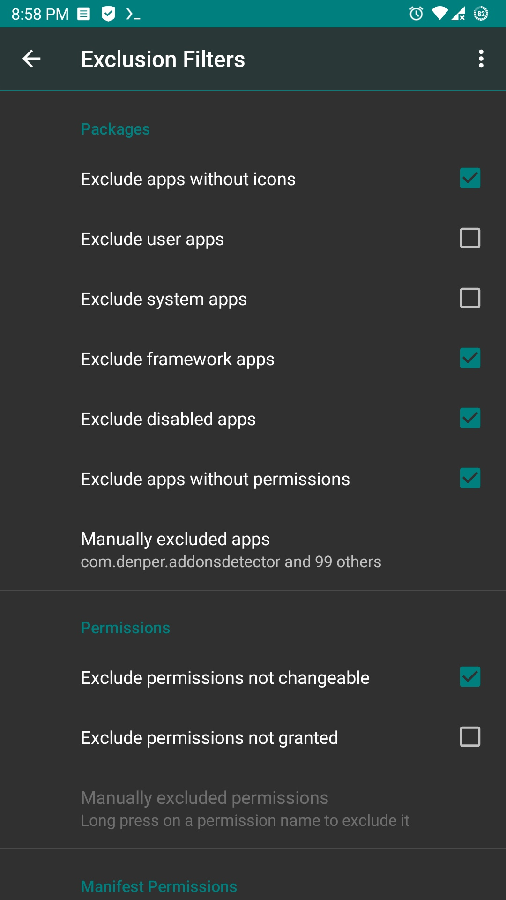
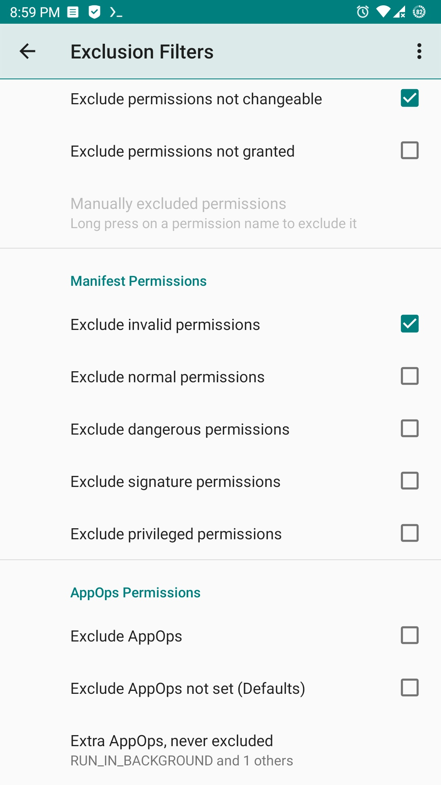

# PermissionManagerX
eXtended Permission Manager for Android - view and set Manifest Permissions and AppOps

  

  

   

* Join Telegram support group to get instant updates and test beta releases.

## Features
Using e<b>X</b>tended <b>Permission Manager</b>, for each installed app, on single screen, you can:

* View, grant or revoke manifest permissions
* View AppOps permissions and choose one of multiple modes
* Set your desired reference value for every changeable permission

<b>Manifest permissions</b> are those normally called permissions e.g. Storage, Camera etc. <b>AppOps</b> (app operations) is a robust framework Android uses at back end for access control. With every Android release manifest permissions are becoming more dependent on AppOps. So it's fun to control both simultaneously and see how they relate to each other.

In short, AppOps provide a fine-grained control over many of the manifest permissions. Plus it provides additional controls like background execution, vibration, clipboard access etc. Just install the app to explore it yourself.

When you reinstall an app, or change your device, or upgrade your ROM, it's a time-taking process to review all installed apps for granted permissions and revoke the unnecessary ones (after all  <b><i>privacy matters</i></b>). PMX provides you the solution. Set <b>reference states</b> of permissions, which can be quickly backed up and restored, and colored bars at left make it quite easy to review packages and permissions at a glance.

Confused? We are here to explain. Please start with:

* <a href="https://mirfatif.github.io/PermissionManagerX/help/en#intro">What is PMX?</a>
* <a href="https://mirfatif.github.io/PermissionManagerX/help/en#faq36">Why do I need to use PMX?</a>
* <a href="https://mirfatif.github.io/PermissionManagerX/help/en#perms_types">What are manifest permissions and AppOps?</a>
* <a href="https://mirfatif.github.io/PermissionManagerX/help/en#perm_ref">Permission References</a>

## Required Privileges / Permissions

* In order to let Permission Manager X serve you at its best, either the device must be <b>rooted</b> or you need to enable <b>ADB over network</b>.
* <b>android.permission.INTERNET</b> is required to use ADB over network. The only connections made outside the device are to check for app updates or to fetch help contents. Pro version also requires internet connection for license verification.

## Note:

* The app is tested on stock Android 7-15 (pro version). Some highly customized ROMs may behave unexpectedly.

## Privacy Policy

[Privacy Policy](https://mirfatif.github.io/PermissionManagerX/privacy_policy.html)

## Paid Features

[Paid Features](https://mirfatif.github.io/PermissionManagerX/help/en#paid_features)

## Screenshots

  
  

## How to Build
`build.gradle` calls a shell script to build native binaries. So a Linux environment is expected with all standard tools.
* Download code: `git clone --depth=1 --recurse-submodules https://github.com/mirfatif/PermissionManagerX.git && cd PermissionManagerX`
* Set `sdk.dir` in `local.properties` to the directory containing Android SDK
* Run `./gradlew :app:assembleRelease`. Or use IntelliJ IDEA / Android Studio.

## Translations 
[Crowdin](https://crowdin.com/project/pmx)

## Third-Party Libraries
Credits and thanks to the developers of:
* [Android Jetpack](https://github.com/androidx/androidx)
* [Android Hidden APIs](https://github.com/anggrayudi/android-hidden-api)
* [LSPass](https://github.com/LSPosed/AndroidHiddenApiBypass)
* [LibADB Android](https://github.com/MuntashirAkon/libadb-android)
* [Spotless GoogleJavaFormat](https://github.com/diffplug/spotless)
* [Material Components for Android](https://github.com/material-components/material-components-android)
* [Guava](https://github.com/google/guava)
* [BetterLinkMovementMethod](https://github.com/saket/Better-Link-Movement-Method)
* [LeakCanary](https://github.com/square/leakcanary)

## License 

You **CANNOT** use and distribute the app icon in anyway, except for **Permission Manager X** (`com.mirfatif.permissionmanagerx`) app.

    Permission Manager X is free software: you can redistribute it and/or modify
    it under the terms of the Affero GNU General Public License as published by
    the Free Software Foundation, either version 3 of the License, or
    (at your option) any later version.

    This program is distributed in the hope that it will be useful,
    but WITHOUT ANY WARRANTY; without even the implied warranty of
    MERCHANTABILITY or FITNESS FOR A PARTICULAR PURPOSE.  See the
    Affero GNU General Public License for more details.

    You should have received a copy of the Affero GNU General Public License
    along with this program.  If not, see <https://www.gnu.org/licenses/>.

## Need Help?

See [Guide and FAQs](https://mirfatif.github.io/PermissionManagerX/help/help.html).

## Want To Support Us?

<table>
    <td></td>
    <td>&nbsp;&nbsp;</td>
</table>

&nbsp;&nbsp;&nbsp;(`bitcoin:18ijfsv5fcDKQ6CTe4wycKxZMmti4oUXjW`)

## Want To Reach Us?

<table>
    <td>&nbsp;<a href="https://t.me/PermissionManagerX"> Telegram</a>&nbsp;</td>
    <td><a href="https://forum.xda-developers.com/t/app-7-0-permission-manager-x-manage-appops-and-manifest-permissions.4187657"> XDA Thread</a></td>
    <td>&nbsp;&nbsp;&nbsp;&nbsp;<a href="mailto:mirfatif.dev@gmail.com"> Email</a>&nbsp;&nbsp;&nbsp;&nbsp;</td>
</table>
